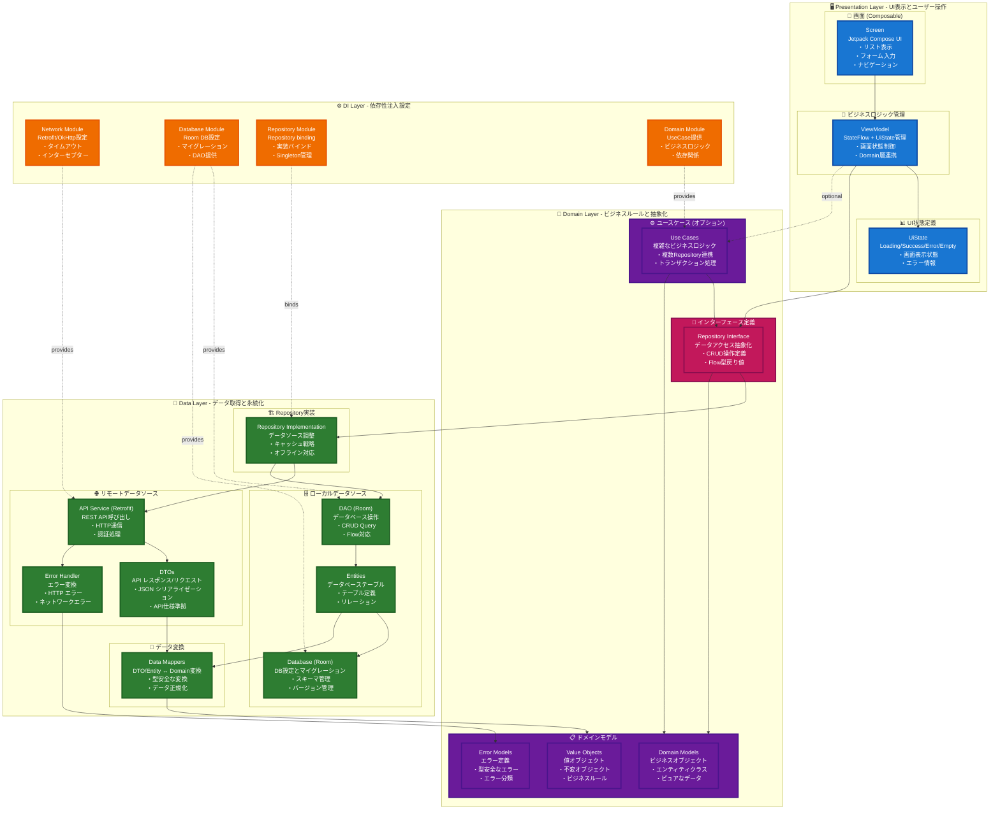
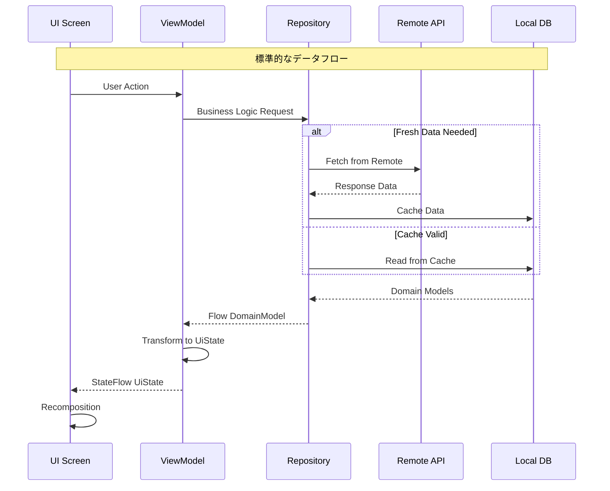
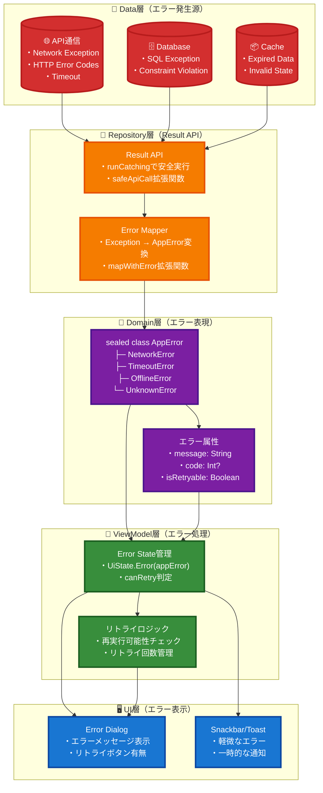
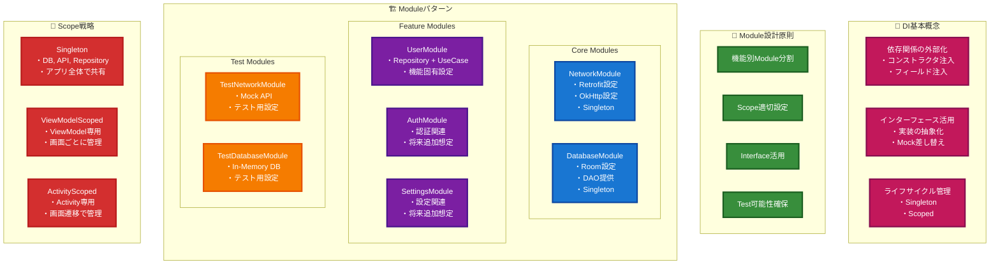
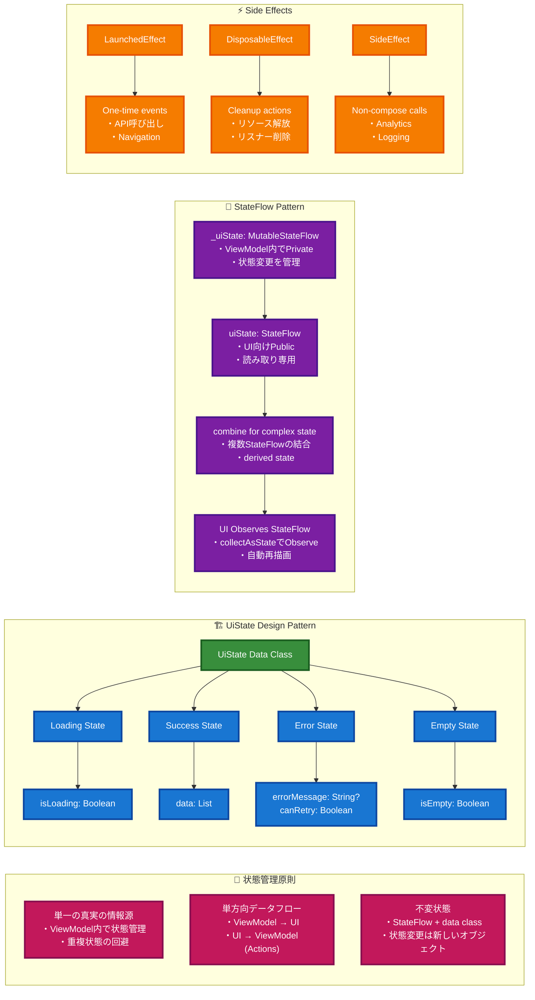
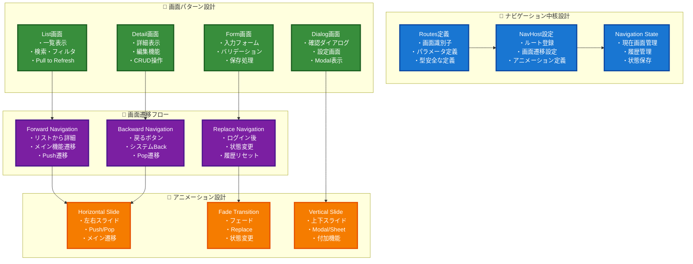
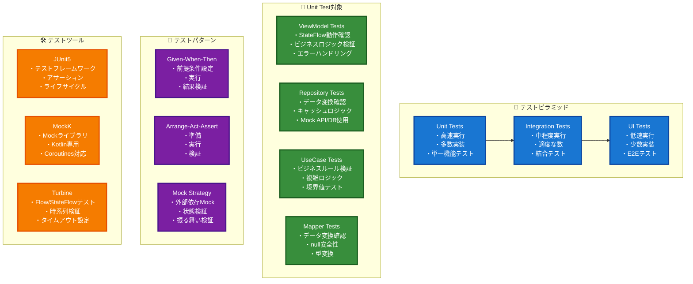

# Android Base App - アーキテクチャガイド

> 新規参画者向け基本構成説明および機能拡張時の設計方針

## Architecture1: 全体アーキテクチャ（Clean Architecture + MVVM）



### 📋 各層の詳細説明

#### 🖥️ Presentation Layer (プレゼンテーション層)
- **責任**: UI表示、ユーザー操作、画面状態管理
- **Screen (Composable)**: UI描画とユーザーインタラクション
  - Pull to Refresh、リスト表示、ナビゲーション制御
- **ViewModel**: ビジネスロジックとUI状態の仲介
  - StateFlow による状態管理、Domain層との連携
- **UiState**: 画面状態の定義 (Loading/Success/Error/Empty)

#### 🎯 Domain Layer (ドメイン層)
- **責任**: ビジネスルール、ドメインモデル、抽象化
- **Repository Interface**: データアクセスの抽象化
  - Data層の実装詳細を隠蔽
- **Domain Models**: ビジネス概念の表現
  - User, Address, AppError等のピュアなデータクラス
- **Use Cases (オプション)**: 複雑なビジネスロジック
  - 複数Repositoryを組み合わせる場合や複雑な処理

#### 💾 Data Layer (データ層)
- **責任**: データ取得、永続化、データソース管理
- **Repository Implementation**: Domain層インターフェースの実装
  - Remote/Local データソースの調整、キャッシュ戦略
- **Remote Data Source**: API通信
  - Retrofit, DTOs, エラーハンドリング
- **Local Data Source**: ローカル永続化
  - Room DB, Entities, DAO
- **Data Mappers**: データ変換
  - DTO ↔ Domain, Entity ↔ Domain

#### ⚙️ DI Layer (依存性注入層)
- **責任**: 依存関係の設定と提供
- **各Module**: コンポーネントの生成と提供
  - Singleton管理、テスト時の差し替え


## Architecture2: データフロー設計原則



## Architecture3: エラーハンドリングフロー

### 📊 エラー処理の階層構造とデータフロー



### 🔍 エラー処理の詳細説明

1. **Data層（発生源）**: 
   - 各種データソースで例外が発生
   - Network、Database、Cacheそれぞれ固有のエラー

2. **Repository層（Result APIでエラーハンドリング）**:
   - **try-catchを使わず**、Kotlin標準のResult APIを活用
   - `runCatching`でエラーを安全にキャッチ
   - 拡張関数でException種別に応じてAppErrorに変換
   ```kotlin
   // Result APIを使用した実装例
   suspend fun refreshUsers(): Result<Unit> {
       return safeApiCall { userApi.getUsers() }
           .mapWithError { userDtos ->
               // データ変換とDB保存処理
               val users = userDtos.map { it.toDomain() }
               saveToDatabase(users)
           }
   }
   ```

3. **Domain層（表現）**:
   - sealed classで型安全なエラー表現
   - ビジネスロジックに応じた分類

4. **ViewModel層（処理）**:
   - Result型のonSuccess/onFailureで処理を分岐
   - **ErrorMessageProvider**でAppErrorをエラーメッセージに変換
   - リトライ可能性の判定
   ```kotlin
   // ErrorMessageProviderを使用した実装例
   .onFailure { throwable ->
       val appError = if (throwable is AppErrorException) {
           throwable.appError
       } else {
           AppError.UnknownError(throwable.message ?: "Unknown error")
       }
       _errorMessage.value = errorMessageProvider.getErrorMessage(appError)
       _canRetry.value = appError.canRetry()
   }
   ```

5. **UI層（表示）**:
   - エラー種別に応じた適切なUI表示
   - ユーザーアクション（リトライ等）の処理

### 📋 ErrorMessageProviderパターン

**Clean Architectureに準拠したエラーメッセージ管理**:

- **Domain層**: `ErrorMessageProvider` インターフェースで抽象化
- **Presentation層**: `AndroidErrorMessageProvider` でString Resources使用
- **DI**: 依存関係の逆転でPlatform固有実装を注入
- **利点**: Domain層がAndroid固有に依存せず、テストも容易、メッセージの一元管理

## Architecture4: DI設計方針（Hilt）

### 🔌 依存性注入の基本概念

**DI（Dependency Injection）** は、クラスが必要とする依存関係を外部から注入する設計パターンです。以下の利点があります：

- **テスタビリティ**: Mock実装を簡単に差し替え可能
- **疎結合**: 具体的な実装に依存しない
- **再利用性**: 同じインターフェースで複数の実装を使い分け
- **保守性**: 設定を一箇所で管理



### 🔧 DI設計ガイドライン

1. **Module分割**: 関連する機能をグループ化
2. **Scope選択**: オブジェクトの生存期間を適切に設定
3. **Interface優先**: 具体的な実装より抽象化を重視
4. **テスト考慮**: Mock実装への差し替えやすさを確保

## Architecture5: UI状態管理パターン

### 🎯 状態管理の基本原則

**UI状態管理** は、アプリケーションの画面状態を予測可能で一貫性のある方法で管理する仕組みです。以下の原則に従います：

- **Single Source of Truth**: 単一の真実の情報源
- **Unidirectional Data Flow**: 単方向データフロー
- **Immutable State**: 不変の状態オブジェクト
- **Reactive Programming**: リアクティブな状態変更



### 🔧 状態管理ガイドライン

1. **UiState設計**: 画面の全状態を1つのdata classで表現
2. **StateFlow活用**: リアクティブな状態変更をStateFlowで管理
3. **Side Effect分離**: 副作用は適切なCompose Effectで処理
4. **状態の最小化**: 必要最小限の状態のみを保持

## Architecture6: ナビゲーション設計パターン

### 🗺️ ナビゲーション設計の基本構造



### 🔧 ナビゲーション設計ガイドライン

1. **Route設計**: 画面識別子を明確に定義、パラメータは型安全に
2. **遷移パターン**: 画面の性質に応じた適切な遷移方法を選択
3. **状態管理**: ナビゲーション状態の適切な保存・復元
4. **アニメーション**: ユーザー体験を向上させる自然な遷移効果

### 📋 実装時の注意点

- **Deep Link対応**: 外部からの直接アクセスを考慮
- **State Restoration**: 画面回転・プロセス復帰時の状態保持
- **Performance**: 画面遷移時のメモリ使用量最適化
- **Testing**: ナビゲーションロジックの単体テスト実装

## Architecture7: Unit Test Guidelines

### 🧪 単体テスト設計ガイドライン



### 📋 Unit Test実装ガイドライン

#### 1. ViewModel テスト - StateFlow状態変化のテスト
```kotlin
// このテストの目的: ViewModelのloadUsers()メソッドが正しい順序で状態を変化させることを検証
@Test
fun `loadUsers should emit loading then success`() = runTest {
    // Given: テストデータの準備
    val users = listOf(mockUser) // 期待する成功時のデータ
    // Repository.getUsers()が呼ばれた時にusersを返すようにMock設定
    coEvery { repository.getUsers() } returns flowOf(users)
    
    // When: テスト対象のメソッドを実行
    viewModel.loadUsers() // ユーザーリスト取得処理を実行
    
    // Then: 状態変化が正しい順序で発生することを検証
    viewModel.uiState.test {
        // 最初にLoading状態が出力されることを確認（読み込み開始）
        assertEquals(UiState.Loading, awaitItem())
        // 次にSuccess状態が出力されることを確認（読み込み完了）
        assertEquals(UiState.Success(users), awaitItem())
    }
    // このテストにより、UI上で正しくローディング表示→成功表示の流れが確認できる
}
```

#### 2. Repository テスト - キャッシュ戦略のテスト
```kotlin
// このテストの目的: キャッシュが有効な時にリモートAPIを呼ばずにキャッシュデータを返すことを検証
@Test
fun `getUsers should return cached data when cache is valid`() = runTest {
    // Given: キャッシュデータとキャッシュ有効性を設定
    val cachedUsers = listOf(mockUser) // キャッシュに保存されているデータ
    // ローカルデータソースがキャッシュデータを返すようにMock設定
    coEvery { localDataSource.getUsers() } returns cachedUsers
    // キャッシュが有効であることを示すMock設定
    coEvery { localDataSource.isCacheValid() } returns true
    
    // When: Repository経由でユーザーデータを取得
    val result = repository.getUsers().first() // 最初に出力される値を取得
    
    // Then: 結果検証
    // 返されたデータがキャッシュデータと一致することを確認
    assertEquals(cachedUsers, result)
    // リモートAPIが呼ばれていないことを確認（キャッシュ有効時は不要）
    coVerify(exactly = 0) { remoteDataSource.getUsers() }
    // このテストにより、オフライン時やパフォーマンス向上のためのキャッシュ機能が正しく動作することを確認
}
```

#### 3. エラーハンドリングテスト例
```kotlin
// このテストの目的: ネットワークエラー時に適切なエラー状態になることを検証
@Test
fun `loadUsers should emit error when network fails`() = runTest {
    // Given: ネットワークエラーをシミュレート
    val networkException = IOException("Network error")
    // Repository.getUsers()が呼ばれた時にエラーを発生させるMock設定
    coEvery { repository.getUsers() } throws networkException
    
    // When: エラーが発生する条件でloadUsers()を実行
    viewModel.loadUsers()
    
    // Then: エラー状態が正しく設定されることを確認
    viewModel.uiState.test {
        assertEquals(UiState.Loading, awaitItem()) // まずLoading状態
        // エラー状態になり、リトライ可能であることを確認
        val errorState = awaitItem() as UiState.Error
        assertEquals(true, errorState.canRetry) // ネットワークエラーはリトライ可能
        assertTrue(errorState.message.contains("Network")) // エラーメッセージにNetwork含まれる
    }
    // このテストにより、ネットワーク障害時にユーザーに適切なエラーメッセージとリトライオプションが表示されることを確認
}
```

#### 4. Result APIを使ったRepositoryテスト例
```kotlin
// このテストの目的: Result APIを使ったエラーハンドリングが正しく動作することを検証
@Test
fun `refreshUsers should return failure Result when API call fails`() = runTest {
    // Given: APIエラーをシミュレート（try-catchを使わない）
    val networkError = IOException("Network error")
    coEvery { userApi.getUsers() } throws networkError
    
    // When: refreshUsersを実行（Result型が返される）
    val result = repository.refreshUsers()
    
    // Then: Result.failureが返されることを確認
    assertTrue(result.isFailure) // 失敗していることを確認
    
    // エラーメッセージがAppErrorに変換されていることを確認
    result.onFailure { throwable ->
        assertTrue(throwable.message?.contains("ネットワークエラー") == true)
    }
    
    // データベースが更新されていないことを確認
    coVerify(exactly = 0) { userDao.deleteAllUsers() }
    coVerify(exactly = 0) { userDao.insertUsers(any()) }
    
    // このテストにより、Result APIベースのエラーハンドリングが
    // 適切にエラーを伝播し、副作用（DB更新）を防ぐことを確認
}

// Result.successのテスト例
@Test
fun `refreshUsers should return success Result when API call succeeds`() = runTest {
    // Given: 正常なAPIレスポンス
    val userDtos = listOf(mockUserDto)
    coEvery { userApi.getUsers() } returns userDtos
    coEvery { userDao.deleteAllUsers() } just Runs
    coEvery { userDao.insertUsers(any()) } just Runs
    
    // When: refreshUsersを実行
    val result = repository.refreshUsers()
    
    // Then: Result.successが返されることを確認
    assertTrue(result.isSuccess)
    
    // データベースが正しく更新されたことを確認
    coVerify(exactly = 1) { userDao.deleteAllUsers() }
    coVerify(exactly = 1) { userDao.insertUsers(any()) }
}
```

#### 5. テスト実行方法

##### Android Studio での実行
1. **単一テストの実行**: テストメソッド横の緑色の▶️ボタンをクリック
2. **クラス全体の実行**: テストクラス名横の▶️ボタンをクリック
3. **モジュール全体の実行**: Project パネルでテストディレクトリを右クリック → "Run Tests"

##### コマンドラインでの実行
```bash
# 全てのUnit Testを実行
./gradlew testDebugUnitTest

# 特定のテストクラスのみ実行
./gradlew testDebugUnitTest --tests "com.example.UserViewModelTest"

# 特定のテストメソッドのみ実行
./gradlew testDebugUnitTest --tests "com.example.UserViewModelTest.loadUsers should emit loading then success"

# テスト結果レポート生成
./gradlew testDebugUnitTest --html
# → build/reports/tests/testDebugUnitTest/index.html でレポート確認可能
```

#### 6. テスト設計原則
- **単一責任**: 1つのテストで1つの機能のみ検証
- **独立性**: テスト間で状態を共有しない
- **可読性**: テスト名と構造で意図を明確に
- **高速実行**: 外部依存は全てMockで置き換え

## 開発時の重要原則

### 設計原則
- **Single Responsibility**: 各クラスは単一の責任を持つ
- **Dependency Inversion**: 抽象に依存し、具象に依存しない
- **Testability**: テストしやすい設計を心がける
- **Consistency**: 既存パターンとの一貫性を保つ

### データフロー原則
- **Unidirectional**: データは一方向に流れる
- **Immutable State**: 状態は不変オブジェクトで管理
- **Reactive**: Flow/StateFlowによるリアクティブプログラミング
- **Error Handling**: 統一されたエラーハンドリング

### パフォーマンス原則
- **Lazy Loading**: 必要な時に必要なデータを読み込む
- **Caching Strategy**: 適切なキャッシュ戦略
- **Background Processing**: UI スレッドをブロックしない
- **Memory Management**: メモリリークの防止