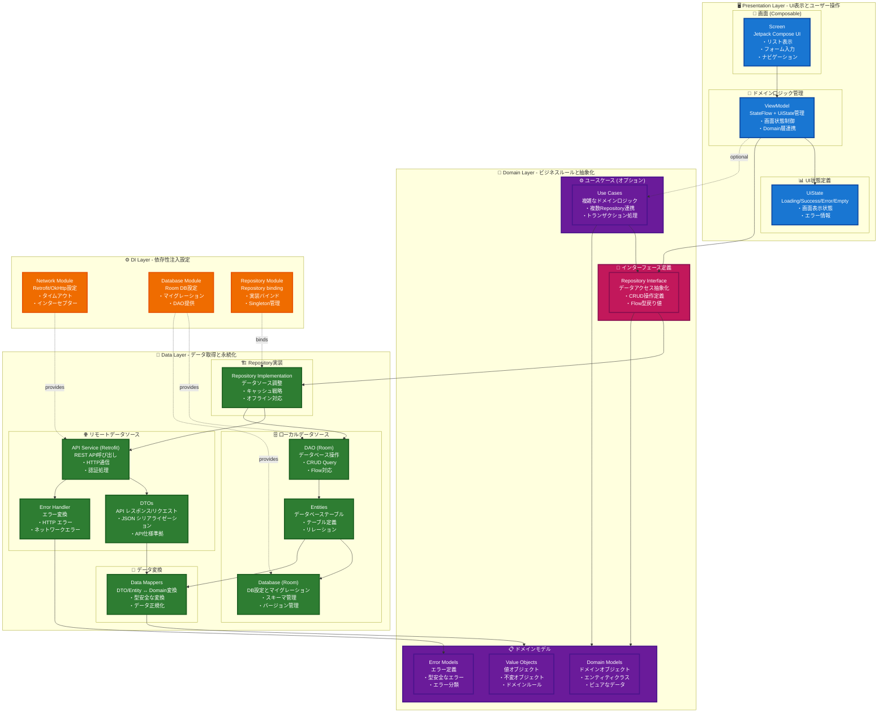
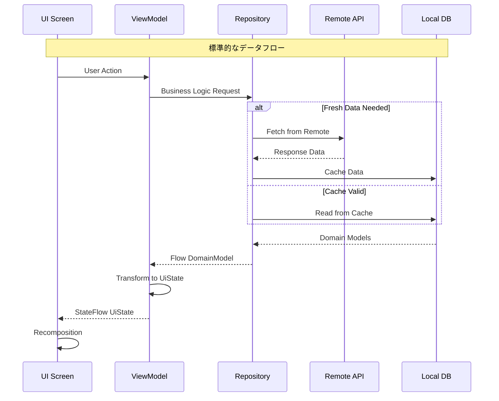
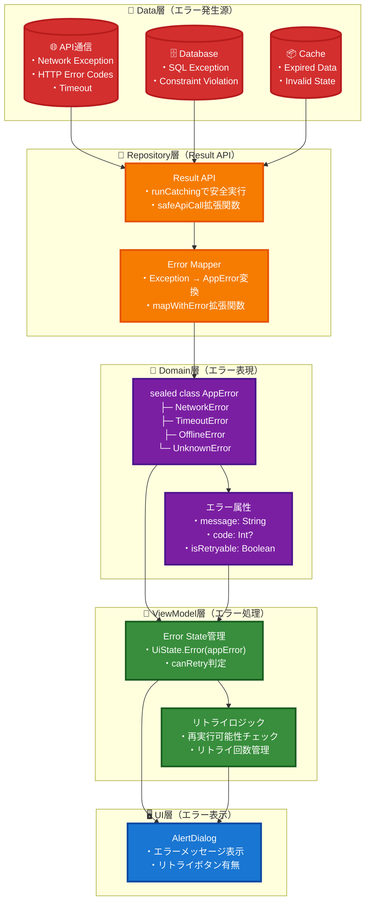
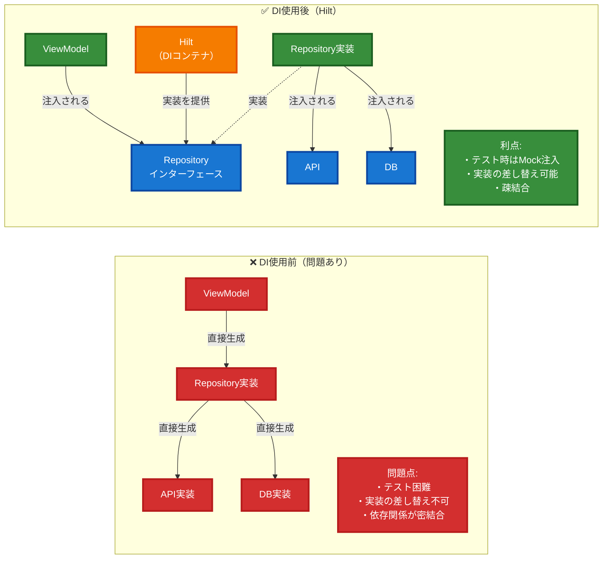
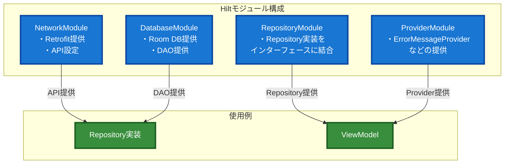
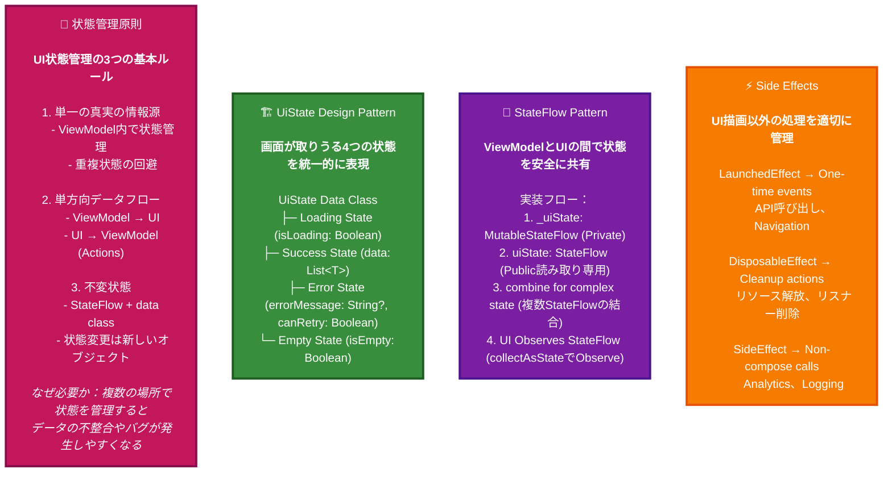
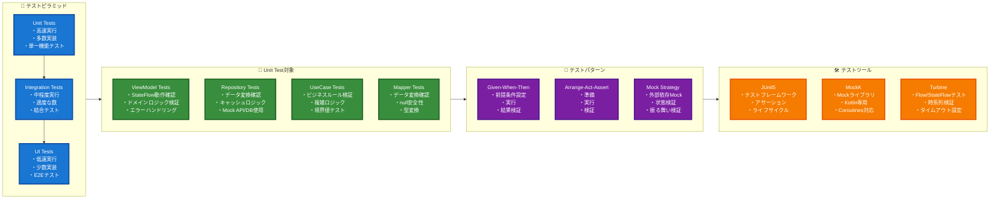

# Android Base App - アーキテクチャガイド

> 新規参画者向け基本構成説明および機能拡張時の設計方針

## Architecture1: 全体アーキテクチャ（Clean Architecture + MVVM）



### 📋 各層の詳細説明

#### 🖥️ Presentation Layer (プレゼンテーション層)
- **責任**: 
  - UI表示、ユーザー操作、画面状態管理
- **Screen (Composable)**: 
  - UI描画とユーザーインタラクション
  - Pull to Refresh、リスト表示、ナビゲーション制御
- **ViewModel**: 
  - ドメインロジックとUI状態の仲介
  - StateFlow による状態管理、Domain層との連携
- **UiState**: 
  - 画面状態の定義 (Loading/Success/Error/Empty)

#### 🎯 Domain Layer (ドメイン層)
- **責任**: 
  - ドメインルール、ドメインモデル、抽象化
- **Repository Interface**: 
  - データアクセスの抽象化
  - Data層の実装詳細を隠蔽
- **Domain Models**: 
  - ドメイン概念の表現
  - User, Address, AppError等のピュアなデータクラス
- **Use Cases (オプション)**: 
  - 複雑なドメインロジック
  - 複数Repositoryを組み合わせる場合や複雑な処理

#### 💾 Data Layer (データ層)
- **責任**: 
  - データ取得、永続化、データソース管理
- **Repository Implementation**: 
  - Domain層インターフェースの実装
  - Remote/Local データソースの調整、キャッシュ戦略
- **Remote Data Source**: 
  - API通信
  - Retrofit, DTOs, エラーハンドリング
- **Local Data Source**: 
  - ローカル永続化
  - Room DB, Entities, DAO
- **Data Mappers**: 
  - データ変換
  - DTO ↔ Domain, Entity ↔ Domain

#### ⚙️ DI Layer (依存性注入層)
- **責任**: 
  - 依存関係の設定と提供
- **各Module**: 
  - コンポーネントの生成と提供
  - Singleton管理、テスト時の差し替え


## Architecture2: データフロー設計原則



## Architecture3: エラーハンドリングフロー

### 📊 エラー処理の階層構造とデータフロー



### 🔍 エラー処理の詳細説明

1. **Data層（発生源）**: 
   - 各種データソースで例外が発生
   - Network、Database、Cacheそれぞれ固有のエラー

2. **Repository層（Result APIでエラーハンドリング）**:
   - **try-catchを使わず**、Kotlin標準のResult APIを活用
   - `runCatching`でエラーを安全にキャッチ
   - 拡張関数でException種別に応じてAppErrorに変換
   ```kotlin
   // Result APIを使用した実装例
   suspend fun refreshUsers(): Result<Unit> {
       // 図の「Result API」層 - safeApiCallで安全実行
       return safeApiCall { userApi.getUsers() }
           // 図の「Error Mapper」層 - mapWithErrorでエラー変換
           .mapWithError { userDtos ->
               // データ変換とDB保存処理
               val users = userDtos.map { it.toDomain() }
               val entities = users.map { it.toEntity() }
               
               userDao.deleteAllUsers()
               userDao.insertUsers(entities)
               Unit
           }
   }
   ```

3. **Domain層（表現）**:
   - sealed classで型安全なエラー表現
   - ドメインロジックに応じた分類

4. **ViewModel層（処理）**:
   - Result型のonSuccess/onFailureで処理を分岐
   - **ErrorMessageProvider**でAppErrorをエラーメッセージに変換
   - リトライ可能性の判定
   ```kotlin
   // ErrorMessageProviderを使用した実装例
   .onFailure { throwable ->
       // 図の「ViewModel層」 - Error State管理
       val appError = if (throwable is AppErrorException) {
           throwable.appError
       } else {
           // 図の「Domain層」 - AppErrorクラスでエラー表現
           AppError.UnknownError(throwable.message ?: "Unknown error")
       }
       // 図の「UI層」に渡すエラーメッセージ生成
       _errorMessage.value = errorMessageProvider.getErrorMessage(appError)
       // 図の「ViewModel層」 - リトライロジック
       _canRetry.value = appError.canRetry()
   }
   ```

5. **UI層（表示）**:
   - エラー種別に応じた適切なUI表示
   - ユーザーアクション（リトライ等）の処理

### 📋 ErrorMessageProviderパターン

**Clean Architectureに準拠したエラーメッセージ管理**:

- **Domain層**: `ErrorMessageProvider` インターフェースで抽象化
- **Presentation層**: `AndroidErrorMessageProvider` でString Resources使用
- **DI**: 依存関係の逆転でPlatform固有実装を注入
- **利点**: Domain層がAndroid固有に依存せず、テストも容易、メッセージの一元管理

## Architecture4: DI設計方針（Hilt）

### 🔌 依存性注入の基本概念

**DI（Dependency Injection）** は、クラスが必要とする依存関係を外部から注入する設計パターンです。以下の利点があります：

- **テスタビリティ**: Mock実装を簡単に差し替え可能
- **疎結合**: 具体的な実装に依存しない
- **再利用性**: 同じインターフェースで複数の実装を使い分け
- **保守性**: 設定を一箇所で管理



### 🎯 DI（依存性注入）とは？

**クラスが必要とする部品を外部から渡す仕組み**です。

#### 例：ViewModelがRepositoryを使う場合

**❌ DI使用前（問題あり）**
```kotlin
class UserListViewModel {
    // 図の「❌ DI使用前」 - ViewModelが直接Repositoryを生成
    private val repository = UserRepositoryImpl(
        UserApi(),      // 直接生成（図の問題点：密結合）
        UserDao()       // 直接生成（図の問題点：テスト困難）
    )
}
```

**✅ DI使用後（Hilt）**
```kotlin
@HiltViewModel
class UserListViewModel @Inject constructor(
    // 図の「✅ DI使用後」 - インターフェースを注入される
    private val repository: UserRepository  // インターフェースを注入
) : ViewModel()

// 図の「Hilt（DIコンテナ）」が実装を管理
@Module
abstract class RepositoryModule {
    @Binds
    @Singleton
    abstract fun bindUserRepository(
        impl: UserRepositoryImpl  // 図の「Repository実装」
    ): UserRepository  // 図の「Repository インターフェース」
}
```

### 🔧 Hiltを使った実装構成



### 📋 重要なポイント

1. **依存関係は自動管理**: `@Inject`を付けるだけで必要な部品が注入される
2. **テストが簡単**: テスト時はMock実装に差し替え可能
3. **設定は一箇所**: Module内で依存関係を一元管理
4. **実装の詳細を隠蔽**: インターフェースを使って疎結合を実現

## Architecture5: UI状態管理パターン

### 🎯 状態管理の基本原則

**UI状態管理** は、アプリケーションの画面状態を予測可能で一貫性のある方法で管理する仕組みです。以下の原則に従います：

- **Single Source of Truth**: 単一の真実の情報源
- **Unidirectional Data Flow**: 単方向データフロー
- **Immutable State**: 不変の状態オブジェクト
- **Reactive Programming**: リアクティブな状態変更



### 📊 実装例の詳細

#### 図2: UiState Design Pattern 実装例
```kotlin
// 図2で示した4つの状態をViewModelで使用
when {
    uiState.isLoading -> ShowLoadingIndicator()        // Loading State対応
    uiState.errorMessage != null -> ShowError(uiState.errorMessage)  // Error State対応
    uiState.isEmpty -> ShowEmptyMessage()              // Empty State対応
    else -> ShowUserList(uiState.users)                // Success State対応
}
```

#### 図3: StateFlow Pattern 実装例
```kotlin
// 図3の実装フローに対応
class UserListViewModel : ViewModel() {
    // 1. _uiState: MutableStateFlow (Private) - 図3-1対応
    private val _uiState = MutableStateFlow(UserListUiState())
    private val _isLoading = MutableStateFlow(false)
    private val _errorMessage = MutableStateFlow<String?>(null)
    
    // 2. uiState: StateFlow (Public読み取り専用) - 図3-2対応
    // 3. combine for complex state (複数StateFlowの結合) - 図3-3対応
    val uiState: StateFlow<UserListUiState> = combine(
        _uiState,
        _isLoading,
        _errorMessage
    ) { state, loading, error ->
        state.copy(
            isLoading = loading,
            errorMessage = error
        )
    }.stateIn(
        scope = viewModelScope,
        started = SharingStarted.WhileSubscribed(5000),
        initialValue = UserListUiState()
    )
    
    // 状態の更新
    fun loadUsers() {
        _isLoading.value = true
        // データ取得処理...
    }
}

// 4. UI Observes StateFlow (collectAsStateでObserve) - 図3-4対応
@Composable
fun UserListScreen(viewModel: UserListViewModel) {
    val uiState by viewModel.uiState.collectAsStateWithLifecycle()
    // uiStateの変更に応じて自動的に再描画
}
```

#### 図4: Side Effects 実装例
```kotlin
// LaunchedEffect → One-time events (図4対応)
@Composable
fun UserScreen(userId: String) {
    LaunchedEffect(userId) {
        // API呼び出し例：ユーザーIDが変わった時だけ再実行
        viewModel.loadUser(userId)
    }
}

// DisposableEffect → Cleanup actions (図4対応)
@Composable
fun LocationScreen() {
    DisposableEffect(Unit) {
        val listener = startLocationUpdates()  // リソース取得
        onDispose {
            stopLocationUpdates(listener)      // リソース解放
        }
    }
}

// SideEffect → Non-compose calls (図4対応)
@Composable
fun AnalyticsScreen(screenName: String) {
    SideEffect {
        // Analytics例：画面が表示される度に記録
        analytics.logScreenView(screenName)
    }
}
```

### 🔧 状態管理ガイドライン

1. **UiState設計**: 画面の全状態を1つのdata classで表現
2. **StateFlow活用**: リアクティブな状態変更をStateFlowで管理
3. **Side Effect分離**: 副作用は適切なCompose Effectで処理
4. **状態の最小化**: 必要最小限の状態のみを保持

## Architecture6: Unit Test Guidelines

### 🧪 単体テスト設計ガイドライン



### 📋 Unit Test実装ガイドライン

#### 1. ViewModel テスト - StateFlow状態変化のテスト
```kotlin
// このテストの目的: ViewModelのloadUsers()メソッドが正しい順序で状態を変化させることを検証
@Test
fun `loadUsers should emit loading then success`() = runTest {
    // 図の「Given-When-Then」パターン - Given（前提条件設定）
    val users = listOf(mockUser) // 期待する成功時のデータ
    // 図の「Mock Strategy」 - 外部依存Mock
    coEvery { repository.getUsers() } returns flowOf(users)
    
    // 図の「Given-When-Then」パターン - When（実行）
    viewModel.loadUsers() // ユーザーリスト取得処理を実行
    
    // 図の「Given-When-Then」パターン - Then（結果検証）
    // 図の「ViewModel Tests」 - StateFlow動作確認
    viewModel.uiState.test {
        // 最初にLoading状態が出力されることを確認（読み込み開始）
        assertEquals(UiState.Loading, awaitItem())
        // 次にSuccess状態が出力されることを確認（読み込み完了）
        assertEquals(UiState.Success(users), awaitItem())
    }
    // このテストにより、UI上で正しくローディング表示→成功表示の流れが確認できる
}
```

#### 2. Repository テスト - キャッシュ戦略のテスト
```kotlin
// このテストの目的: キャッシュが有効な時にリモートAPIを呼ばずにキャッシュデータを返すことを検証
@Test
fun `getUsers should return cached data when cache is valid`() = runTest {
    // 図の「Arrange-Act-Assert」パターン - Arrange（準備）
    val cachedUsers = listOf(mockUser) // キャッシュに保存されているデータ
    // 図の「Mock Strategy」 - 外部依存Mock
    coEvery { localDataSource.getUsers() } returns cachedUsers
    // 図の「Repository Tests」 - キャッシュロジック検証
    coEvery { localDataSource.isCacheValid() } returns true
    
    // 図の「Arrange-Act-Assert」パターン - Act（実行）
    val result = repository.getUsers().first() // 最初に出力される値を取得
    
    // 図の「Arrange-Act-Assert」パターン - Assert（検証）
    // 返されたデータがキャッシュデータと一致することを確認
    assertEquals(cachedUsers, result)
    // 図の「Mock Strategy」 - 振る舞い検証
    coVerify(exactly = 0) { remoteDataSource.getUsers() }
    // このテストにより、オフライン時やパフォーマンス向上のためのキャッシュ機能が正しく動作することを確認
}
```

#### 3. エラーハンドリングテスト例
```kotlin
// このテストの目的: ネットワークエラー時に適切なエラー状態になることを検証
@Test
fun `loadUsers should emit error when network fails`() = runTest {
    // 図の「Given-When-Then」パターン - Given（前提条件設定）
    val networkException = IOException("Network error")
    // 図の「Mock Strategy」 - 外部依存Mock
    coEvery { repository.getUsers() } throws networkException
    
    // 図の「Given-When-Then」パターン - When（実行）
    viewModel.loadUsers()
    
    // 図の「Given-When-Then」パターン - Then（結果検証）
    // 図の「ViewModel Tests」 - エラーハンドリング検証
    viewModel.uiState.test {
        assertEquals(UiState.Loading, awaitItem()) // まずLoading状態
        // エラー状態になり、リトライ可能であることを確認
        val errorState = awaitItem() as UiState.Error
        assertEquals(true, errorState.canRetry) // ネットワークエラーはリトライ可能
        assertTrue(errorState.message.contains("Network")) // エラーメッセージにNetwork含まれる
    }
    // このテストにより、ネットワーク障害時にユーザーに適切なエラーメッセージとリトライオプションが表示されることを確認
}
```

#### 4. Result APIを使ったRepositoryテスト例
```kotlin
// このテストの目的: Result APIを使ったエラーハンドリングが正しく動作することを検証
@Test
fun `refreshUsers should return failure Result when API call fails`() = runTest {
    // 図の「Given-When-Then」パターン - Given（前提条件設定）
    val networkError = IOException("Network error")
    // 図の「Mock Strategy」 - Mock API/DB使用
    coEvery { userApi.getUsers() } throws networkError
    
    // 図の「Given-When-Then」パターン - When（実行）
    val result = repository.refreshUsers()
    
    // 図の「Given-When-Then」パターン - Then（結果検証）
    // 図の「Repository Tests」 - データ変換確認
    assertTrue(result.isFailure) // 失敗していることを確認
    
    // エラーメッセージがAppErrorに変換されていることを確認
    result.onFailure { throwable ->
        assertTrue(throwable.message?.contains("ネットワークエラー") == true)
    }
    
    // 図の「Mock Strategy」 - 振る舞い検証
    coVerify(exactly = 0) { userDao.deleteAllUsers() }
    coVerify(exactly = 0) { userDao.insertUsers(any()) }
    
    // このテストにより、Result APIベースのエラーハンドリングが
    // 適切にエラーを伝播し、副作用（DB更新）を防ぐことを確認
}

// Result.successのテスト例
@Test
fun `refreshUsers should return success Result when API call succeeds`() = runTest {
    // 図の「Given-When-Then」パターン - Given（前提条件設定）
    val userDtos = listOf(mockUserDto)
    // 図の「Mock Strategy」 - Mock API/DB使用
    coEvery { userApi.getUsers() } returns userDtos
    coEvery { userDao.deleteAllUsers() } just Runs
    coEvery { userDao.insertUsers(any()) } just Runs
    
    // 図の「Given-When-Then」パターン - When（実行）
    val result = repository.refreshUsers()
    
    // 図の「Given-When-Then」パターン - Then（結果検証）
    // 図の「Repository Tests」 - データ変換確認
    assertTrue(result.isSuccess)
    
    // 図の「Mock Strategy」 - 振る舞い検証
    coVerify(exactly = 1) { userDao.deleteAllUsers() }
    coVerify(exactly = 1) { userDao.insertUsers(any()) }
}
```

#### 5. テスト実行方法

##### Android Studio での実行
1. **単一テストの実行**: テストメソッド横の緑色の▶️ボタンをクリック
2. **クラス全体の実行**: テストクラス名横の▶️ボタンをクリック
3. **モジュール全体の実行**: Project パネルでテストディレクトリを右クリック → "Run Tests"

##### コマンドラインでの実行
```bash
# 全てのUnit Testを実行
./gradlew testDebugUnitTest

# 特定のテストクラスのみ実行
./gradlew testDebugUnitTest --tests "com.example.UserViewModelTest"

# 特定のテストメソッドのみ実行
./gradlew testDebugUnitTest --tests "com.example.UserViewModelTest.loadUsers should emit loading then success"

# テスト結果レポート生成
./gradlew testDebugUnitTest --html
# → build/reports/tests/testDebugUnitTest/index.html でレポート確認可能
```

#### 6. テスト設計原則
- **単一責任**: 1つのテストで1つの機能のみ検証
- **独立性**: テスト間で状態を共有しない
- **可読性**: テスト名と構造で意図を明確に
- **高速実行**: 外部依存は全てMockで置き換え

## 開発時の重要原則

### 設計原則
- **Single Responsibility**: 各クラスは単一の責任を持つ
- **Dependency Inversion**: 抽象に依存し、具象に依存しない
- **Testability**: テストしやすい設計を心がける
- **Consistency**: 既存パターンとの一貫性を保つ

### データフロー原則
- **Unidirectional**: データは一方向に流れる
- **Immutable State**: 状態は不変オブジェクトで管理
- **Reactive**: Flow/StateFlowによるリアクティブプログラミング
- **Error Handling**: 統一されたエラーハンドリング

### パフォーマンス原則
- **Lazy Loading**: 必要な時に必要なデータを読み込む
- **Caching Strategy**: 適切なキャッシュ戦略
- **Background Processing**: UI スレッドをブロックしない
- **Memory Management**: メモリリークの防止