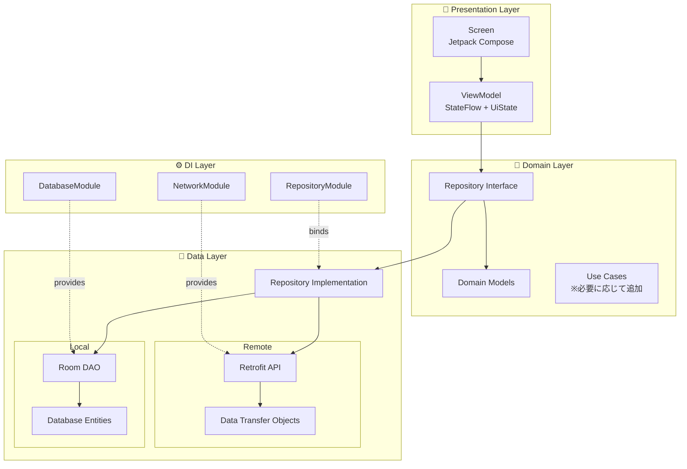
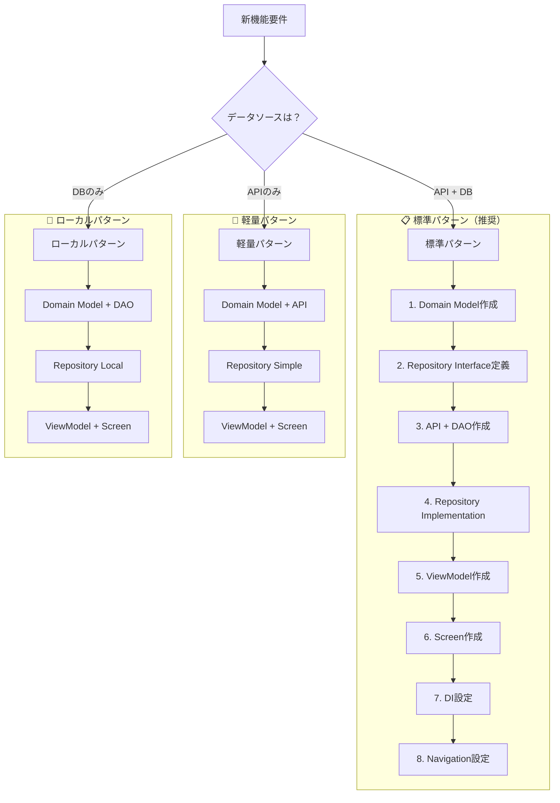
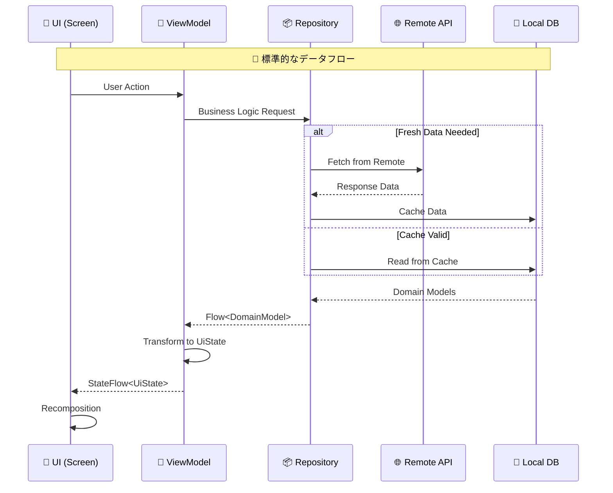
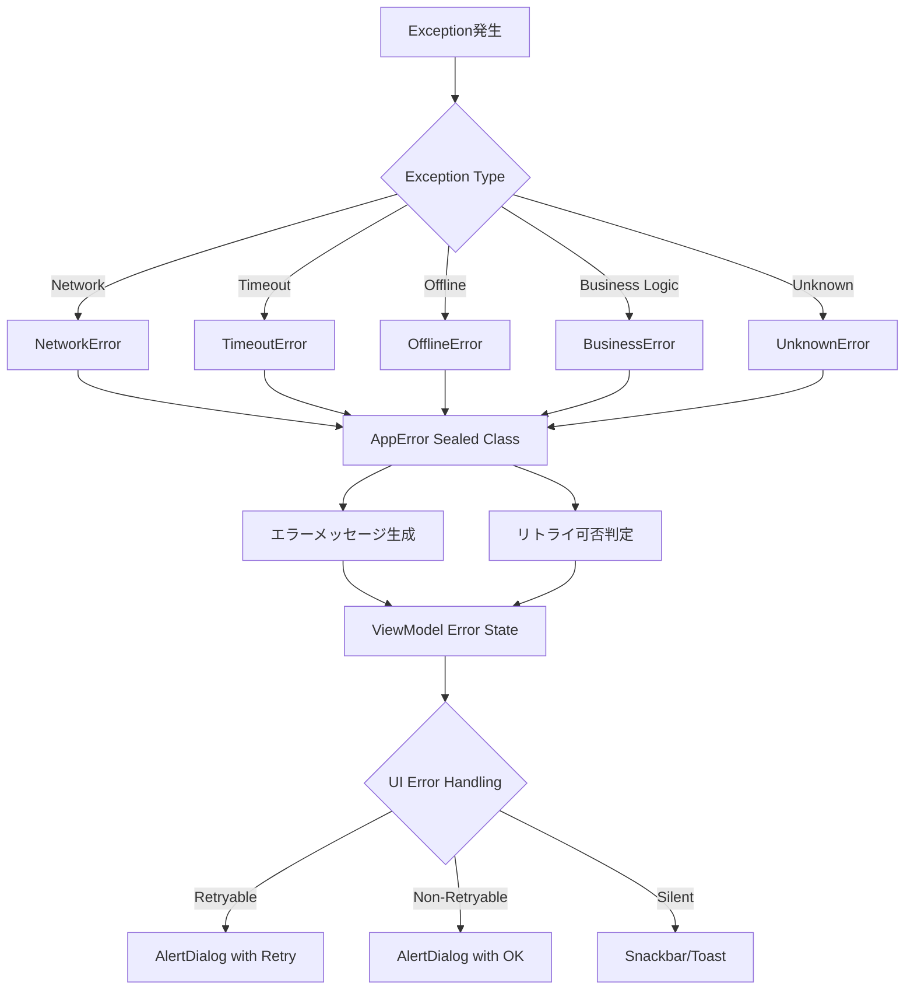
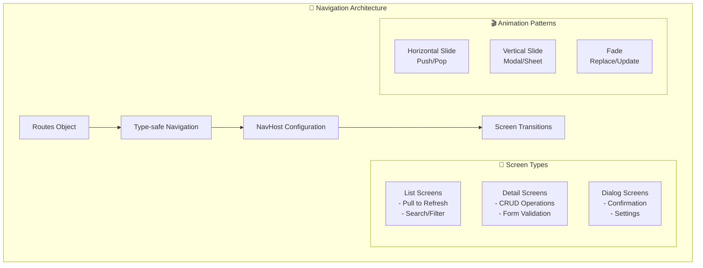
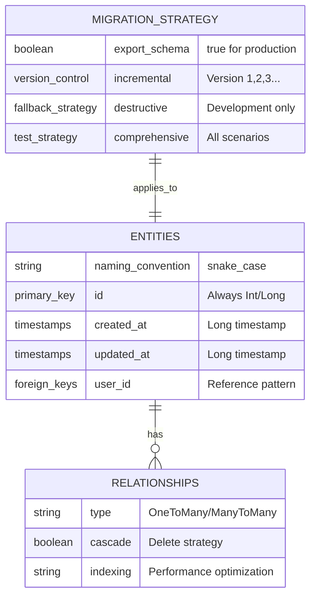
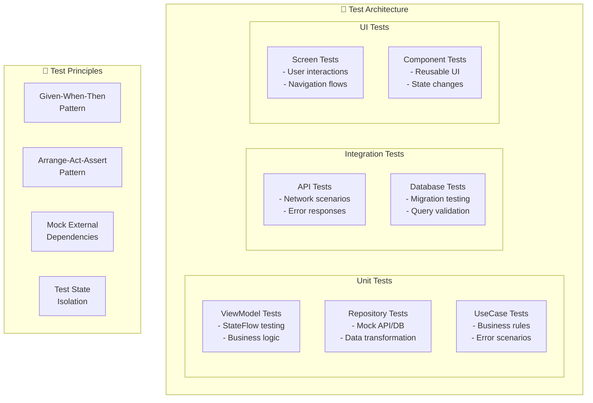
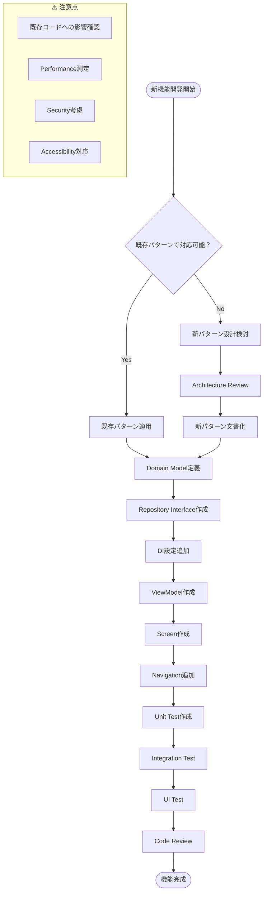

# Android Base App - アーキテクチャガイド

> 新規参画者向け基本構成説明および機能拡張時の設計方針

## 1. 全体アーキテクチャ（Clean Architecture + MVVM）



## 2. 新規画面作成時の標準パターン



## 3. データフロー設計原則



## 4. エラーハンドリング統一設計



## 5. DI設計方針（Hilt）

```mermaid
graph TB
    subgraph "🏗️ Module設計原則"
        A[機能別Module分割]
        B[Scope適切設定]
        C[Interface活用]
        D[Test可能性確保]
    end
    
    subgraph "📁 Moduleパターン"
        direction TB
        
        subgraph "Core Modules"
            NetMod[NetworkModule<br/>@Singleton]
            DBMod[DatabaseModule<br/>@Singleton]
        end
        
        subgraph "Feature Modules"
            UserMod[UserModule<br/>Repository + UseCase]
            AuthMod[AuthModule<br/>※将来追加想定]
            SettingMod[SettingsModule<br/>※将来追加想定]
        end
        
        subgraph "Test Modules"
            TestNetMod[TestNetworkModule]
            TestDBMod[TestDatabaseModule]
        end
    end
    
    subgraph "🎯 Scope戦略"
        SingletonScope["@Singleton<br/>DB, API, Repository"]
        ViewModelScope["@ViewModelScoped<br/>ViewModel"]
        ActivityScope["@ActivityScoped<br/>Navigation"]
    end
```

## 6. UI状態管理パターン

```mermaid
graph LR
    subgraph "🎨 UiState Design Pattern"
        A[UiState Data Class] --> B[Loading State]
        A --> C[Success State]
        A --> D[Error State]
        A --> E[Empty State]
        
        B --> F[isLoading: Boolean]
        C --> G[data: List&lt;T&gt;]
        D --> H[errorMessage: String?<br/>canRetry: Boolean]
        E --> I[isEmpty: Boolean]
    end
    
    subgraph "🔄 StateFlow Pattern"
        J[_uiState: MutableStateFlow] --> K[uiState: StateFlow]
        K --> L[combine() for complex state]
        L --> M[UI Observes StateFlow]
    end
    
    subgraph "⚡ Side Effects"
        N[LaunchedEffect] --> O[One-time events]
        P[DisposableEffect] --> Q[Cleanup actions]
        R[SideEffect] --> S[Non-compose calls]
    end
```

## 7. ナビゲーション設計パターン



## 8. データベース設計原則



## 9. テスト戦略



## 10. 機能拡張時のチェックリスト



## 📝 開発時の重要原則

### 🎯 設計原則
- **Single Responsibility**: 各クラスは単一の責任を持つ
- **Dependency Inversion**: 抽象に依存し、具象に依存しない
- **Testability**: テストしやすい設計を心がける
- **Consistency**: 既存パターンとの一貫性を保つ

### 🔄 データフロー原則
- **Unidirectional**: データは一方向に流れる
- **Immutable State**: 状態は不変オブジェクトで管理
- **Reactive**: Flow/StateFlowによるリアクティブプログラミング
- **Error Handling**: 統一されたエラーハンドリング

### 🚀 パフォーマンス原則
- **Lazy Loading**: 必要な時に必要なデータを読み込む
- **Caching Strategy**: 適切なキャッシュ戦略
- **Background Processing**: UI スレッドをブロックしない
- **Memory Management**: メモリリークの防止