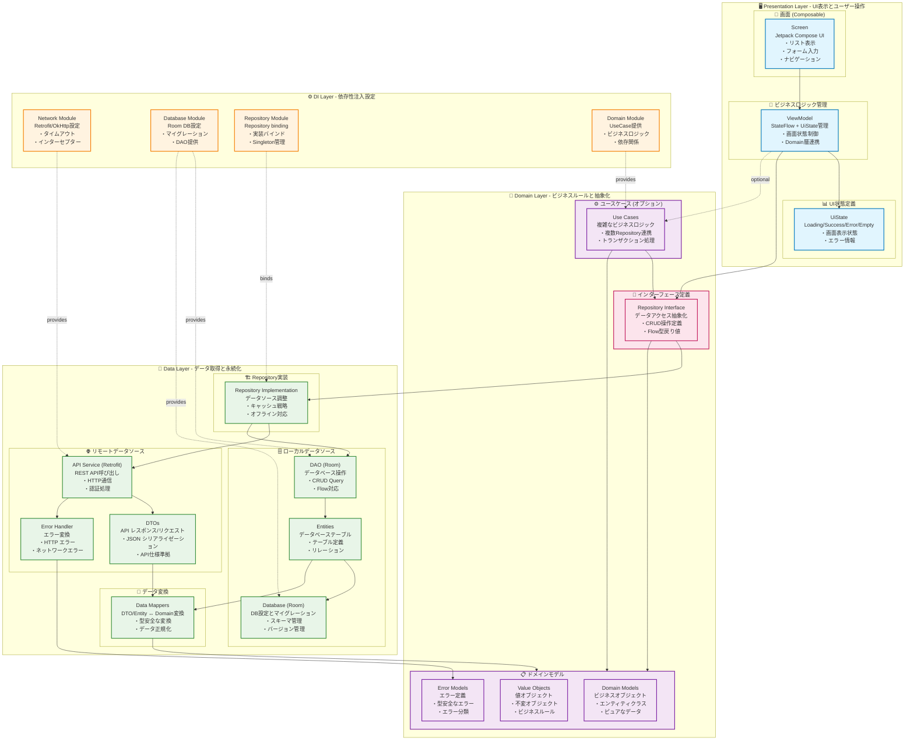
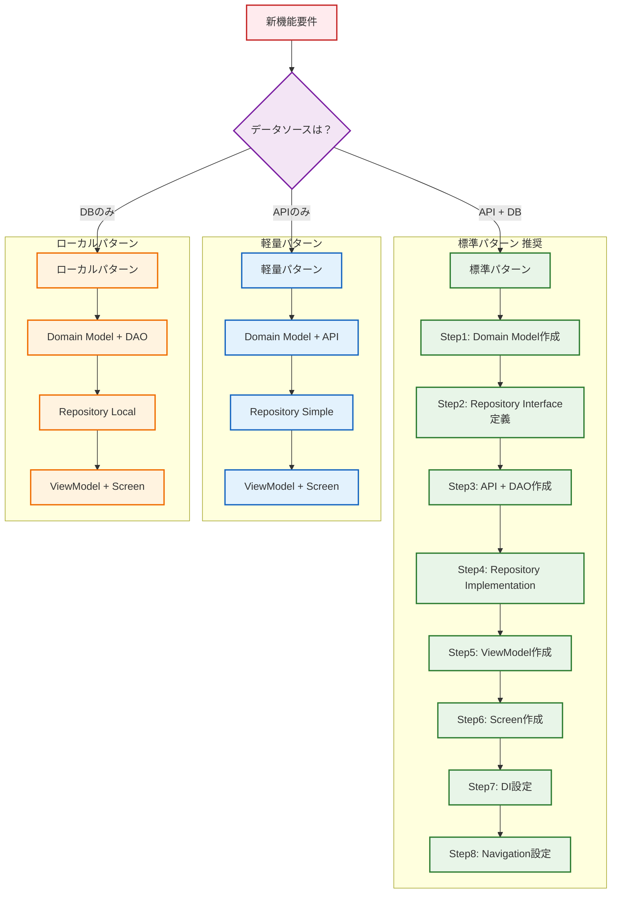
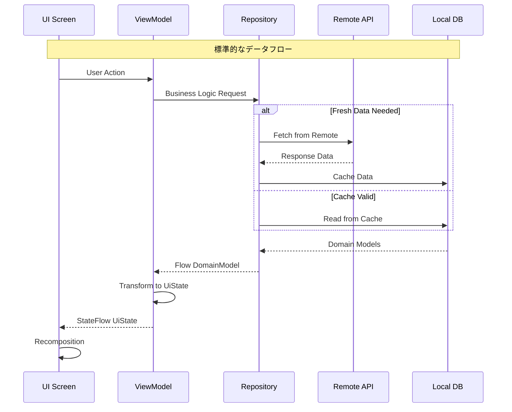
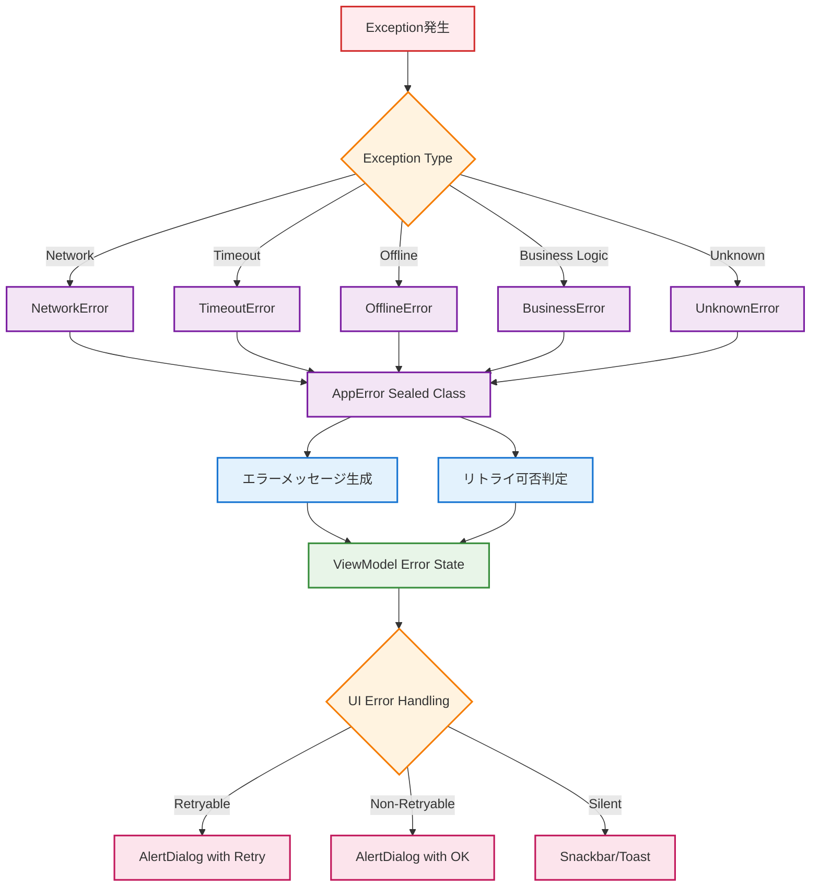
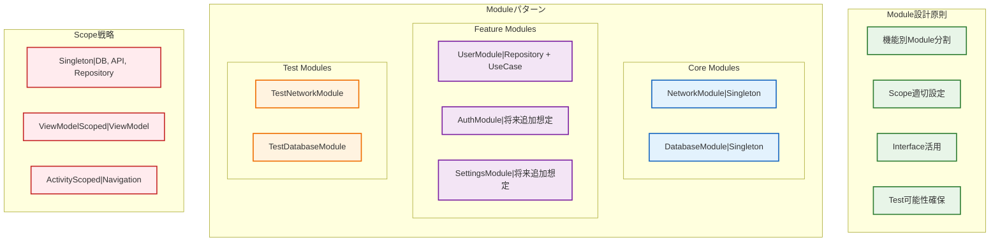
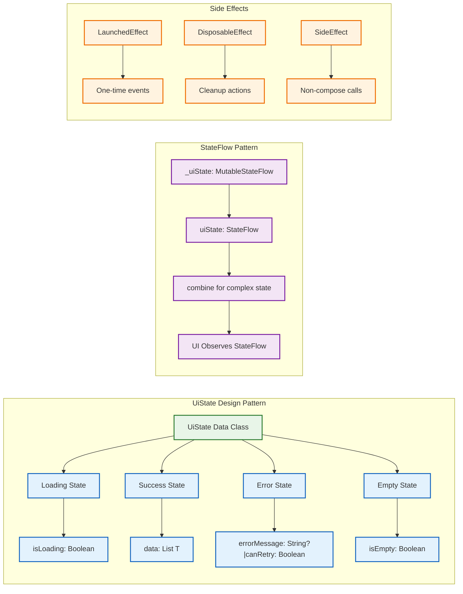
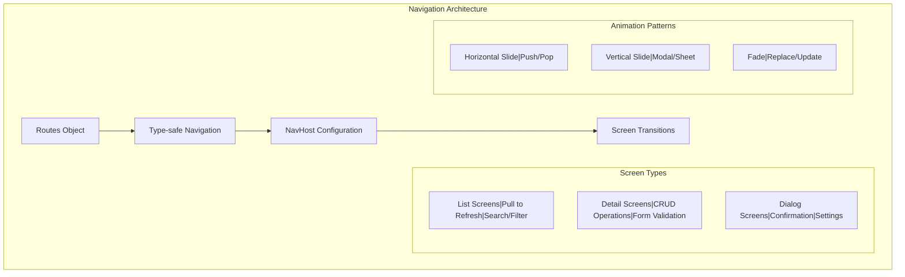
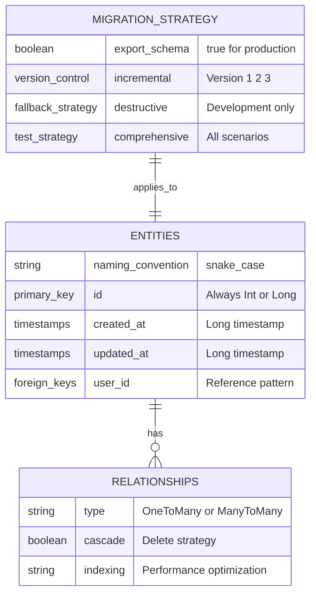
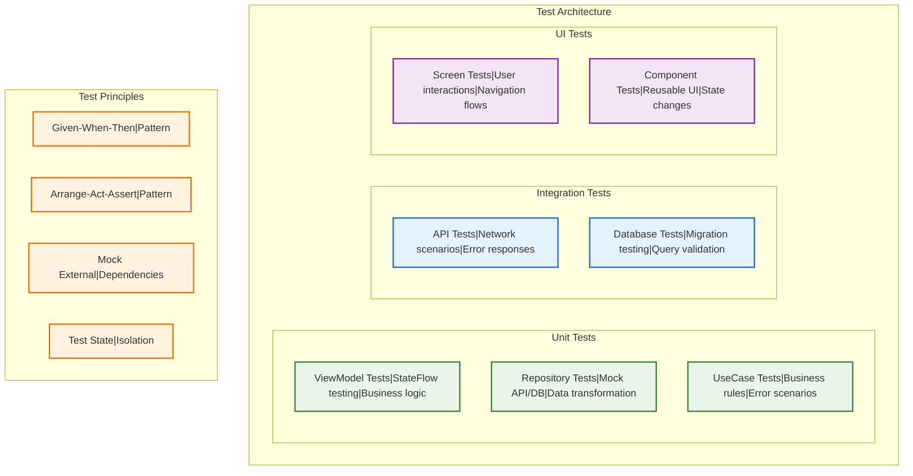
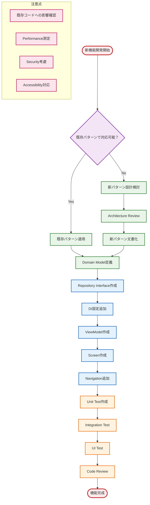

# Android Base App - アーキテクチャガイド

> 新規参画者向け基本構成説明および機能拡張時の設計方針

## Architecture1: 全体アーキテクチャ（Clean Architecture + MVVM）

### 📋 各層の詳細説明

#### 🖥️ Presentation Layer (プレゼンテーション層)
- **責任**: UI表示、ユーザー操作、画面状態管理
- **Screen (Composable)**: UI描画とユーザーインタラクション
  - Pull to Refresh、リスト表示、ナビゲーション制御
- **ViewModel**: ビジネスロジックとUI状態の仲介
  - StateFlow による状態管理、Domain層との連携
- **UiState**: 画面状態の定義 (Loading/Success/Error/Empty)

#### 🎯 Domain Layer (ドメイン層)
- **責任**: ビジネスルール、ドメインモデル、抽象化
- **Repository Interface**: データアクセスの抽象化
  - Data層の実装詳細を隠蔽
- **Domain Models**: ビジネス概念の表現
  - User, Address, AppError等のピュアなデータクラス
- **Use Cases (オプション)**: 複雑なビジネスロジック
  - 複数Repositoryを組み合わせる場合や複雑な処理

#### 💾 Data Layer (データ層)
- **責任**: データ取得、永続化、データソース管理
- **Repository Implementation**: Domain層インターフェースの実装
  - Remote/Local データソースの調整、キャッシュ戦略
- **Remote Data Source**: API通信
  - Retrofit, DTOs, エラーハンドリング
- **Local Data Source**: ローカル永続化
  - Room DB, Entities, DAO
- **Data Mappers**: データ変換
  - DTO ↔ Domain, Entity ↔ Domain

#### ⚙️ DI Layer (依存性注入層)
- **責任**: 依存関係の設定と提供
- **各Module**: コンポーネントの生成と提供
  - Singleton管理、テスト時の差し替え

## Architecture2: 新規画面作成時の標準パターン

## Architecture3: データフロー設計原則

## Architecture4: エラーハンドリング統一設計

## Architecture5: DI設計方針（Hilt）

## Architecture6: UI状態管理パターン

## Architecture7: ナビゲーション設計パターン

## Architecture8: データベース設計原則

## Architecture9: テスト戦略

## Architecture10: 機能拡張時のチェックリスト

## 開発時の重要原則

### 設計原則
- **Single Responsibility**: 各クラスは単一の責任を持つ
- **Dependency Inversion**: 抽象に依存し、具象に依存しない
- **Testability**: テストしやすい設計を心がける
- **Consistency**: 既存パターンとの一貫性を保つ

### データフロー原則
- **Unidirectional**: データは一方向に流れる
- **Immutable State**: 状態は不変オブジェクトで管理
- **Reactive**: Flow/StateFlowによるリアクティブプログラミング
- **Error Handling**: 統一されたエラーハンドリング

### パフォーマンス原則
- **Lazy Loading**: 必要な時に必要なデータを読み込む
- **Caching Strategy**: 適切なキャッシュ戦略
- **Background Processing**: UI スレッドをブロックしない
- **Memory Management**: メモリリークの防止